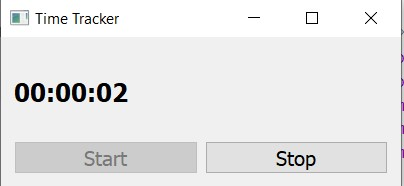

# Time-Tracker
Этот код представляет собой графическую программу на PyQt5, которая позволяет пользователю контролировать своё время работы. После запуска программы пользователь может нажать кнопку "Start", чтобы начать отслеживать своё время работы, и кнопку "Stop", чтобы остановить отслеживание времени. При нажатии на кнопку "Start" время начала работы сохраняется, и программа обновляет отображаемое время каждую секунду. Когда пользователь нажимает на кнопку "Stop", программа останавливает отслеживание времени и сбрасывает отображаемое время. Если пользователь пытается закрыть программу, когда отслеживание времени включено, появляется диалоговое окно, в котором запрашивается подтверждение закрытия без сохранения времени.

